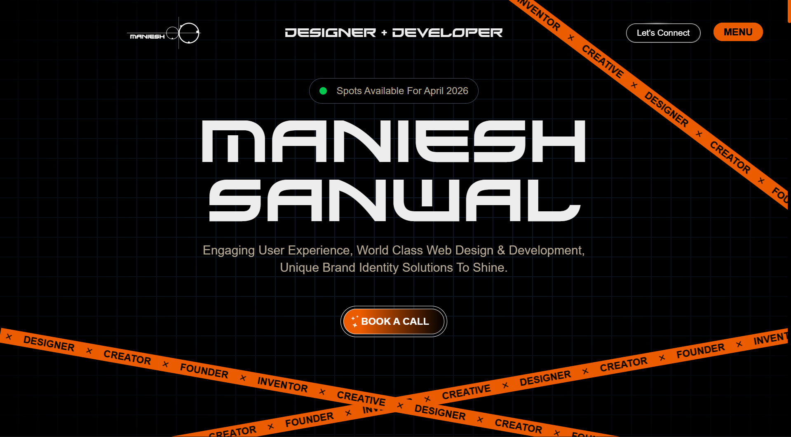

<div align="center">



# Maniesh Sanwal — Portfolio

**Creative Developer · UI/UX Designer · AI Engineer**

Engaging user experience, world-class web design & development,
unique brand identity solutions to shine.

[](https://manieshsanwal.in)
[](https://cal.com/manieshsanwal/30min)

</div>

---

## ✦ About

Specializing in impressive online experiences, I deliver tailored solutions to elevate digital presence. Each project aims to capture attention and engage audiences effectively — pairing strong visual design and development skills with a focus on **User-centered Design** & **Business-driven Development**.

> *"My inspiration begins with engineering, contemporary technological solutions, and innovation.
> Each design element is an extension of the interface function. It's the purest expression of personality."*

---

## ✦ Skillset & Tech Stack

| # | Skill | Key Capabilities | Tech Stack |
|---|-------|-----------------|------------|
| 01 | **UI / UX Design** | User research & wireframes · Interactive prototyping · Visual design systems · Usability testing | `Figma` `Adobe XD` `Framer` `Maze` `FigJam` `Sketch` |
| 02 | **Web Design** | Responsive layouts · Typography & color theory · Brand-aligned aesthetics · Motion & micro-interactions | `CSS3` `Tailwind CSS` `Framer Motion` `GSAP` `Spline` |
| 03 | **Web Development** | Next.js / React apps · Performance optimization · Clean & scalable code · API integrations | `Next.js` `React` `TypeScript` `Express.js` `Node.js` `Prisma` `PostgreSQL` `MongoDB` |
| 04 | **AI SaaS App** | AI-powered product design · Subscription & billing flows · Dashboard & analytics UI · Scalable cloud architecture | `Stripe` `Razorpay` `Firebase` `Supabase` `Vercel` `OpenAI API` `Gemini API` `Redis` |
| 05 | **AI Agents** | Conversational AI flows · LLM integration · Autonomous task automation · Custom agent pipelines | `LangChain` `OpenAI` `Python` `Pinecone` `CrewAI` |
| 06 | **AI Automation** | Workflow automation · Data pipeline design · Third-party API orchestration · Intelligent scheduling & triggers | `n8n` `Zapier` `Make` `Python` `Cron Jobs` |

---

## ✦ Services

| # | Service | Description |
|---|---------|-------------|
| 01 | **Strategy & Discovery** | Deep-dive research into your brand, audience, and market landscape to build a rock-solid foundation. |
| 02 | **Design & Prototyping** | Pixel-perfect interfaces crafted with purpose — beautiful designs that convert visitors into customers. |
| 03 | **Development & Build** | Clean, performant code using modern frameworks — fast-loading sites that scale with your business. |
| 04 | **AI Integration** | Intelligent features powered by AI — chatbots, automation, and data-driven experiences that set you apart. |

---

## ✦ My Process

```
◈ Discover  →  ◇ Define  →  △ Design  →  □ Develop  →  ○ Deploy
```

From sleek design to seamless functionality, I turn ideas into digital experiences tailored for your product, audience, and goals. I work with startups, growing agencies, and enterprises — adapting my tools to each task.

---

## ✦ Featured Projects

### UI / UX Design
- **HealthPulse** — Health-tracking app with intuitive dashboard, habit streaks, and personalized wellness insights
- **EduVerse** — Online learning platform redesign with 40% improved task-completion rate
- **TravelMate** — Mobile-first travel planning with drag-and-drop itinerary builder
- **FinTrack Pro** — Personal finance dashboard with spending pattern visualization

### Web Design
- **Velour Studio** — Luxury fashion brand website with immersive parallax effects
- **Prism Creative** — Creative agency portfolio with bold typography and scroll animations
- **Artisan Brew** — Craft brewery microsite with rich storytelling and custom maps
- **SoundScape** — Music festival landing page with dynamic gradient backgrounds

### Web Development
- **DevBoard** — Real-time collaborative developer dashboard with Git analytics
- **ShopStream** — High-performance e-commerce storefront with Stripe integration
- **BlogForge** — Blazing-fast blogging platform with MDX and full-text search
- **EventHub** — Event management platform serving 10K+ events with QR check-in

### AI SaaS App
- **NeuralMetrics** — AI-powered analytics with predictive revenue forecasting
- **ContentForge AI** — Content generation platform with brand-voice training
- **ResumeAI Pro** — AI resume builder with ATS compatibility analysis
- **DesignMind** — AI design assistant generating UI mockups from text prompts

### AI Agents
- **AgentFlow** — Autonomous AI agent platform for customer support using RAG pipelines
- **SalesBot AI** — Intelligent sales agent that qualifies leads and books meetings
- **CodeReview Agent** — AI-powered code review with GitHub PR analysis
- **ResearchBot** — Research agent that crawls papers and maintains knowledge graphs

### AI Automation
- **FlowSync** — Enterprise workflow engine with 50+ third-party integrations
- **InboxZero AI** — Email automation reducing management time by 80%
- **DataHarvest** — Automated data extraction from 100+ sources
- **SocialPilot AI** — Social media automation with AI content generation

---

## ✦ Stats

| 30+ Projects Delivered | 22+ Happy Clients | 3+ Years Experience | 98% Client Satisfaction |
|:---:|:---:|:---:|:---:|

---

## ✦ Tech Stack Overview

**Frontend:** Next.js 15 · React 19 · TypeScript · Tailwind CSS · Framer Motion · GSAP · Three.js · Spline  
**Backend:** Node.js · Express.js · Prisma · tRPC · FastAPI · Python  
**Database:** PostgreSQL · MongoDB · Redis · Supabase · Firebase · Pinecone · Qdrant  
**AI/ML:** OpenAI GPT-4o · Claude API · LangChain · CrewAI · LangGraph · Vercel AI SDK  
**Payments:** Stripe · Razorpay  
**Automation:** n8n · Zapier · Make · Apache Airflow · Prefect  
**Deployment:** Vercel · Docker · AWS Lambda · Cloudflare R2  
**Design:** Figma · Adobe XD · Framer · Sketch · Spline 3D

---

## ✦ Site Structure

```
/                → Home (Hero + Work Intro + Gallery + About + Expertise + Contact)
/work            → Featured projects organized by skillset
/expertise       → Services, process, and core values
/about           → Detailed about section
/contact         → Contact form and social links
```

---

## ✦ Getting Started

```bash
# Clone the repository
git clone https://github.com/Maniesh-dev/portfolio.git

# Navigate to the project
cd portfolio

# Install dependencies
npm install

# Run the development server
npm run dev
```

Open [http://localhost:3000](http://localhost:3000) to view the portfolio locally.

---

## ✦ Built With

| Technology | Purpose |
|-----------|---------|
| [Next.js 15](https://nextjs.org) | React framework with App Router & Turbopack |
| [React 19](https://react.dev) | UI component library |
| [TypeScript](https://typescriptlang.org) | Type safety |
| [Tailwind CSS 4](https://tailwindcss.com) | Utility-first styling |
| [Framer Motion](https://motion.dev) | Animations & transitions |
| [GSAP](https://gsap.com) | Advanced scroll-based animations |
| [Three.js](https://threejs.org) | 3D visuals |
| [Lenis](https://lenis.darkroom.engineering) | Smooth scrolling |
| [Lucide React](https://lucide.dev) | Icon system |
| [Resend](https://resend.com) | Transactional email API |
| [Vercel](https://vercel.com) | Hosting & deployment |

---

## ✦ Contact

- **Email:** manieshsanwal.dev@gmail.com
- **WhatsApp:** [+91 9251296134](https://wa.me/919251296134)
- **Book a Call:** [cal.com/manieshsanwal](https://cal.com/manieshsanwal/30min)

<div align="center">

---

**© Design & Build by Maniesh Sanwal**

*Available for freelance projects*

</div>
